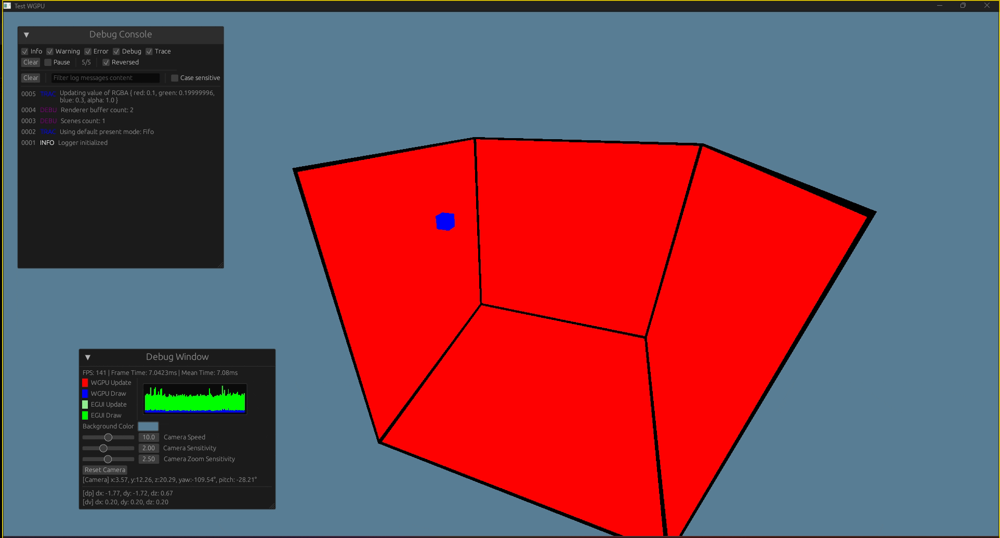

# wgpu-experimentation

This project is an exploration of the WGPU graphics library. The goal is to create a simple 3D graphics program that renders a cube and allows the user to rotate and zoom in/out. Debug information is displayed using the EGUI library.

## GOL - Example

Small game of life implementation


```rust
use core::f32;
use std::{cell::RefCell, rc::Rc, vec};

// TODO: Re-implement this by using texture instead of shapes

use cgmath::Vector3;
use test_wgpu::{widget, App, Config, Instance, Logger, Scene, Shape};

struct GameOfLife {
    grid: Vec<bool>,
    size_grid: usize,
    size_ratio: f32,
    shape_alive: Rc<RefCell<Shape>>,
    shape_dead: Rc<RefCell<Shape>>,
    shape_frame: Rc<RefCell<Shape>>, // ...
    last_update: std::time::Instant,
    time_debug:
        Rc<RefCell<widget::Label<(std::time::Duration, std::time::Duration)>>>,
}

const ALIVE: [f32; 3] = [1.0, 1.0, 1.0];
const DEAD: [f32; 3] = [0.0, 0.0, 0.0];

impl GameOfLife {
    fn new(size_grid: usize, alive_probability: f32) -> Self {
        let size_shape = BOX_SIZE;
        let grid: Vec<bool> = (0..size_grid * size_grid)
            .map(|_| rand::random::<f32>() < alive_probability)
            .collect();
        let size_ratio = size_shape / size_grid as f32;
        let p1 = Vector3::new(-size_ratio / 2.0, -size_ratio / 2.0, 0.0);
        let p2 = Vector3::new(size_ratio / 2.0, size_ratio / 2.0, 1.0);

        let shape_alive = Shape::rect(p1, p2, ALIVE, vec![]);
        let shape_dead = Shape::rect(p1, p2, DEAD, vec![]);
        let delta = 0.5;
        let shape_frame = Shape::rect(
            Vector3::new(-delta, -delta, 0.01),
            Vector3::new(size_shape + delta, size_shape + delta, 0.99),
            [1.0, 0.0, 0.0],
            vec![Instance::identity()],
        );

        let time_debug = widget::Label::new(
            (
                std::time::Duration::from_micros(0),
                std::time::Duration::from_micros(0),
            ),
            |(a, b)| {
                format!(
                    "Update: {:.2}ms, Render: {:.2}ms",
                    a.as_micros() as f32 / 1000.0,
                    b.as_micros() as f32 / 1000.0
                )
            },
        );

        Self {
            grid,
            size_grid,
            size_ratio,
            shape_alive: Rc::new(RefCell::new(shape_alive)),
            shape_dead: Rc::new(RefCell::new(shape_dead)),
            shape_frame: Rc::new(RefCell::new(shape_frame)),
            last_update: std::time::Instant::now(),
            time_debug,
        }
    }

    fn tick(&mut self) {
        // Update the gird
        // ...
    }
}

impl Scene for GameOfLife {
    fn update(&mut self, _dt: std::time::Duration) {
        // tick && Update shapes
    }

    fn shapes(&self) -> Vec<std::rc::Rc<std::cell::RefCell<Shape>>> {
        vec![
            self.shape_alive.clone(),
            self.shape_dead.clone(),
            self.shape_frame.clone(),
        ]
    }

    fn debug_item(&self) -> Vec<Rc<RefCell<dyn widget::debug::DebugItem>>> {
        vec![self.time_debug.clone()]
    }
    // ...
}

const GRID_SIZE: usize = 300;
const TIME_STEP: f32 = 0.0 / 20.0;
const BOX_SIZE: f32 = 20.0;

fn main() -> Result<(), Box<dyn std::error::Error>> {
    let config = Config::init();
    Logger::setup(config.disable_egui).expect("Failed to setup logger");
    let mut app = App::new(config);
    app.add_scene(Box::new(GameOfLife::new(GRID_SIZE, 0.6)));
    pollster::block_on(
        app.run(include_str!("../src/graphics/shaders/shader.wgsl")),
    )
    .expect("Failed to run the application");

    Ok(())
}
```

## DVD - Example

Small example of bouncing cube in a box


```rust
use std::{cell::RefCell, rc::Rc};

use cgmath::Vector3;
use test_wgpu::{
    widget::{debug::DebugItem, Label},
    App, Config, Instance, Logger, Scene, Shape,
};

struct MyApp {
    shapes: Vec<Rc<RefCell<Shape>>>,
    center: Vector3<f32>,
    velocity: Rc<RefCell<Label<Vector3<f32>>>>,
    acceleration: Rc<RefCell<Label<Vector3<f32>>>>,
    min_point: Vector3<f32>,
    max_point: Vector3<f32>,
    size: Vector3<f32>,
}

impl MyApp {
    fn new() -> Self {
        let min_point = Vector3::new(-10.0, -10.0, -10.0);
        let max_point = Vector3::new(10.0, 10.0, 10.0);
        let size = Vector3::new(1.0, 1.0, 1.0);
        let center = Vector3::new(0.0, 0.0, 0.0);
        let velocity = Vector3::new(2.5, 1.0, 0.3);
        let acceleration = Vector3::new(0.2, 0.2, 0.2);

        let velocity = Label::new(velocity, |v| {
            format!("[dp] dx: {:.2}, dy: {:.2}, dz: {:.2}", v.x, v.y, v.z)
        });
        let acceleration = Label::new(acceleration, |a| {
            format!("[dv] dx: {:.2}, dy: {:.2}, dz: {:.2}", a.x, a.y, a.z)
        });

        let inner_rect =
            Shape::rect(-size / 2.0, size / 2.0, [0.0, 0.0, 1.0], vec![]);
        let outer_rect = Shape::rect(
            max_point,
            min_point,
            [1.0, 0.0, 0.0],
            vec![Instance::identity()],
        );

        Self {
            shapes: vec![
                Rc::new(RefCell::new(inner_rect)),
                Rc::new(RefCell::new(outer_rect)),
            ],
            center,
            velocity,
            acceleration,
            min_point,
            max_point,
            size,
        }
    }

    fn tick(&mut self, dt: std::time::Duration) {
        let acceleration = self.acceleration.borrow();
        let mut velocity = self.velocity.borrow_mut();
        {
            let acceleration = acceleration.get();
            let velocity = velocity.get_mut();

            *velocity += acceleration * dt.as_secs_f32();
            self.center += *velocity * dt.as_secs_f32();

            if self.center.x > self.max_point.x - self.size.x / 2.0
                || self.center.x < self.min_point.x + self.size.x / 2.0
            {
                velocity.x *= -1.0;
            }
            if self.center.y > self.max_point.y - self.size.y / 2.0
                || self.center.y < self.min_point.y + self.size.y / 2.0
            {
                velocity.y *= -1.0;
            }
            if self.center.z > self.max_point.z - self.size.z / 2.0
                || self.center.z < self.min_point.z + self.size.z / 2.0
            {
                velocity.z *= -1.0;
            }

            let mut inner_rect = self.shapes[0].borrow_mut();
            inner_rect.set_instances(vec![Instance::new(
                self.center,
                cgmath::Quaternion::new(1.0, 0.0, 0.0, 0.0),
            )]);
        }
    }
}

impl Scene for MyApp {
    fn debug_item(&self) -> Vec<Rc<RefCell<dyn DebugItem>>> {
        vec![self.velocity.clone(), self.acceleration.clone()]
    }

    fn update(&mut self, dt: std::time::Duration) {
        self.tick(dt);
    }

    fn shapes(&self) -> Vec<Rc<RefCell<Shape>>> {
        self.shapes.clone()
    }
}

fn main() {
    let config = Config::init();
    // Setup logger
    Logger::setup(config.disable_egui).expect("Failed to setup logger");
    let mut app = App::new(config);
    app.add_scene(Box::new(MyApp::new()));

    pollster::block_on(
        app.run(include_str!("../src/graphics/shaders/shader_edge.wgsl")),
    ).expect("Failed to run the application");
}
```

# Presentation

todo

# Modules Documentattion

The redaction of this section is still on progress.

## `debug` Module Docuementation

todo

## `camera` Module Documentation

todo

## `shape` Macro Documentation

### Overview

The `shape` macro helps in creating a collection of vertices and indices for a shape, typically used in graphics programming. It takes a color for the vertices and a set of named points with their positions. Additionally, it specifies the indices to define the shape's faces.

### Macro Structure

#### Syntax

```rust
shape!(
    color;
    name1 => pos1,
    name2 => pos2,
    ...;
    pointA1 pointB1 pointC1,
    pointA2 pointB2 pointC2,
    ...
)
```

#### Parameters

1. **color**: The color for all vertices.
2. **name => pos**: Named points with their respective positions.
3. **pointA pointB pointC**: Triangles defined by the indices of named points to form the shape.

#### Example Usage

```rust
let (mut vertices, indices) = shape!(
    [1.0, 0.0, 0.0]; // Color for vertices
    // Vertex positions
    A => [0.0, 1.0, 1.0],
    B => [1.0, 1.0, 1.0],
    C => [1.0, 0.0, 1.0],
    D => [0.0, 0.0, 1.0],
    E => [0.0, 1.0, 0.0],
    F => [1.0, 1.0, 0.0],
    G => [1.0, 0.0, 0.0],
    H => [0.0, 0.0, 0.0];
    // Indices for triangles
    // Front face
    A D C,
    A C B,
    // Back face
    E F G,
    G H E,
    // Top face
    E A B,
    B F E,
    // Bottom face
    H G C,
    C D H,
    // Left face
    A E H,
    H D A,
    // Right face
    F B C,
    C G F,
);
```

### Detailed Breakdown

1. **Color Definition**:

   ```rust
    [1.0, 0.0, 0.0]; // Color for vertices
   ```

   This part defines the color used for all vertices.

2. **Vertex Definitions**:

   ```rust
   A => [0.0, 1.0, 1.0],
   B => [1.0, 1.0, 1.0],
   ...
   ```

   Each vertex is given a name (e.g., `A`, `B`, etc.) and a position in 3D space.

3. **Triangle Definitions**:
   ```rust
   // Front face
   A D C,
   A C B,
   ...
   ```
   These define the faces of the shape by specifying the vertices that make up each triangle.

### Macro Internals

The macro expands into code that initializes a vector of vertices and indices based on the provided definitions.

- **Vertex Initialization**:

  ```rust
  shape!(@step 0u16, vertex, $color, $($name, $pos),*);
  ```

  This recursive part of the macro assigns indices to each named vertex and pushes them into the `vertex` vector.

- **Indices Initialization**:
  ```rust
  $(
      indices.push($pointA);
      indices.push($pointB);
      indices.push($pointC);
  )*
  ```
  This part iterates over the provided triangles and adds the corresponding indices to the `indices` vector.

### Final Output

The macro returns a tuple containing two vectors:

- **vertices**: A vector of `Vertex` instances, each created with a position and color.
- **indices**: A vector of indices defining the triangles that make up the shape.

### Notes

- Ensure the `Vertex` struct and `crate::graphics::Vertex::new` function are correctly defined in your project.
- The `#[allow(non_snake_case)]` attribute is used to permit non-standard naming for the generated vertex variables.

## Todo

- Better camera handle
- Understand projection system
- Render spheres.
